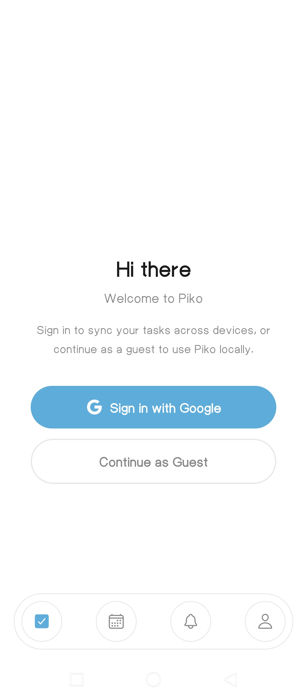
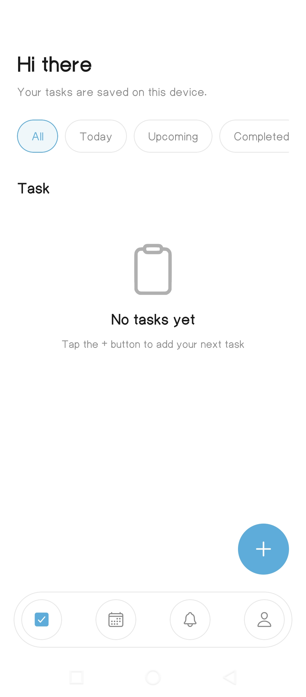
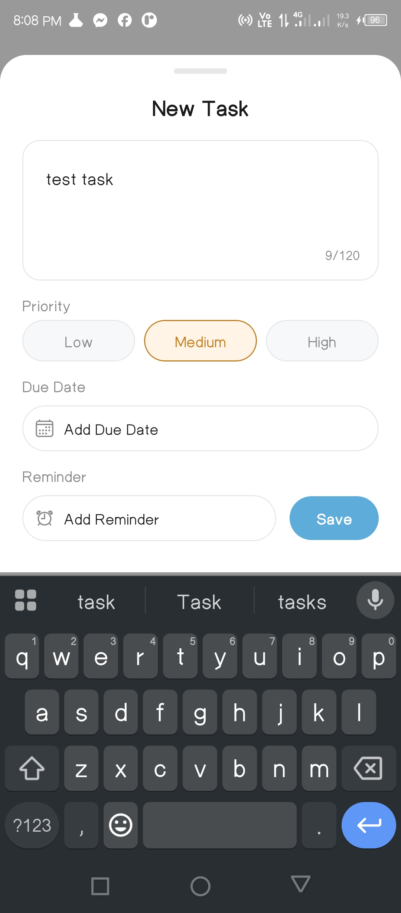
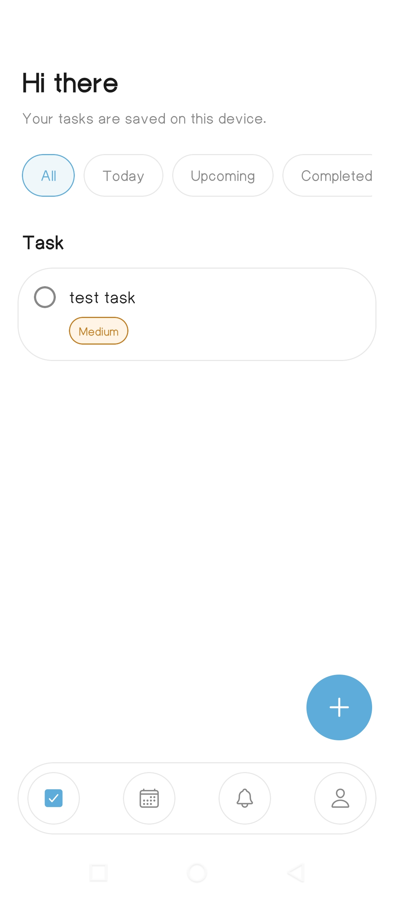
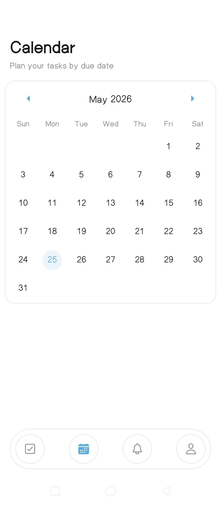
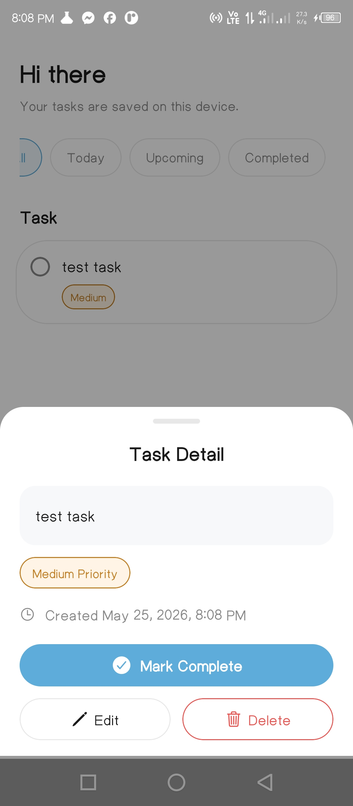
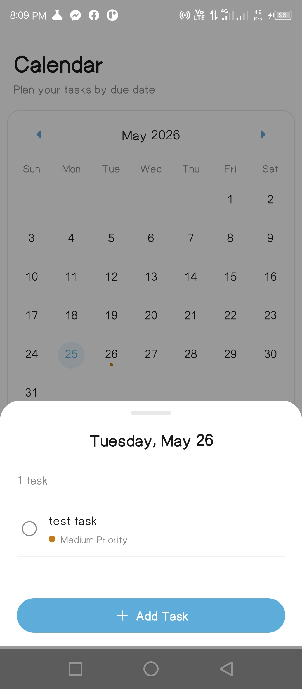
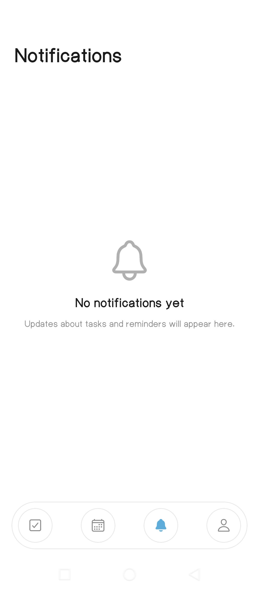
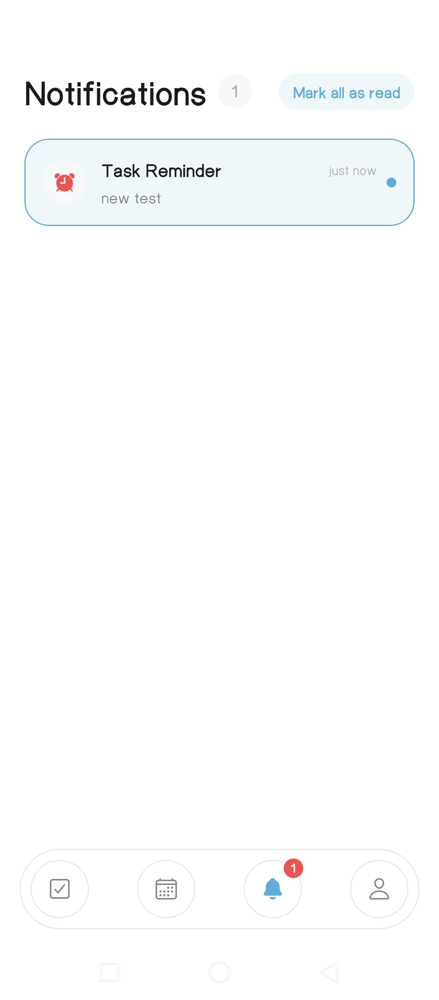
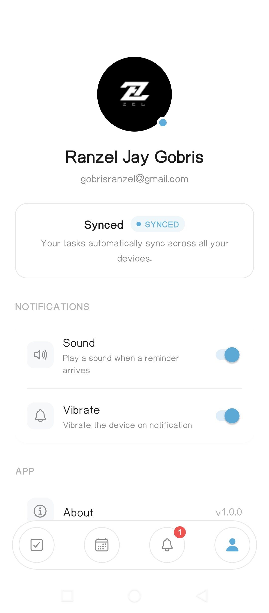

# Piko

Piko is a mobile task management application built with **Expo**, **React Native**, and **Firebase**. It focuses on simple personal task management with offline-friendly local storage, authenticated cloud sync, task reminders, and a tab-based user experience.

---

## 1. Midterm vs Final Feature List

### Midterm Features

- Basic task creation, editing, completion, and deletion
- Pending/completed task views
- Calendar view for date-based task browsing
- Bottom tab navigation across main screens
- Local task persistence using AsyncStorage
- Guest mode for using the app without signing in
- Task due dates and priority support

### Final Features

- Everything from the midterm stage
- Google Sign-In authentication
- Firebase-backed private cloud sync
- Realtime task updates through Firestore listeners
- Offline-aware sync lifecycle with retry/degraded/error handling
- Guest-to-account migration flow
- Notification reminders using Expo Notifications
- In-app notification center with read/delete actions
- Session-scoped storage separation between guest data and authenticated user data
- Offline status indicator in the profile screen
- Hardened Firestore rules for per-user data isolation

---

## 2. Architecture Overview

### Folder Structure

```text
Piko/
├─ app/                  # Expo Router screens and layouts
│  ├─ _layout.tsx        # App root layout / providers / startup wiring
│  └─ (tabs)/            # Main tabbed screens
│     ├─ calendar.tsx
│     ├─ index.tsx       # Main tasks screen
│     ├─ notifications.tsx
│     └─ profile.tsx
├─ components/           # Reusable UI and feature components
│  ├─ calendar/
│  ├─ notifications/
│  ├─ tasks/
│  └─ ui/
├─ constants/            # Theme and shared constants
├─ contexts/             # React context providers
│  └─ AuthContext.tsx
├─ hooks/                # Reusable React hooks
├─ services/             # Business logic and platform integration
│  ├─ taskService.ts
│  ├─ SyncOrchestrator.ts
│  ├─ storageService.ts
│  ├─ notificationService.ts
│  └─ migrationService.ts
├─ types/                # Shared TypeScript types and enums
├─ utils/                # Pure helper utilities
└─ firebase.rules        # Firestore security rules
```

### State Approach

The app uses a **layered state approach**:

- **React Context**
  - `AuthContext.tsx` manages authentication state, guest mode, sync state, and network/offline awareness.

- **Service Layer**
  - `taskService.ts` provides task CRUD operations.
  - `SyncOrchestrator.ts` coordinates upload, hydration, realtime updates, and offline retry behavior.
  - `storageService.ts` handles local persistence.
  - `migrationService.ts` manages guest-to-authenticated task migration.
  - `notificationService.ts` handles reminder scheduling and in-app notification storage.

- **Local Persistence**
  - AsyncStorage is used for local task data, user session markers, pending sync queues, and notifications.

- **Cloud Sync**
  - Firestore is used for authenticated users’ private task and notification data.

### Navigation Approach

The app uses **Expo Router** with **file-based routing**:

- `app/_layout.tsx` defines the root layout and startup behavior.
- `app/(tabs)/_layout.tsx` provides the bottom tab navigation shell.
- Main tabs include:
  - **Tasks**
  - **Calendar**
  - **Notifications**
  - **Profile**

This keeps navigation simple and consistent with Expo Router conventions.

---

## 3. Firebase Configuration Approach

Firebase is integrated through the native Firebase packages:

- `@react-native-firebase/app`
- `@react-native-firebase/auth`
- `@react-native-firebase/firestore`

### Configuration Files

- `google-services.json` is used for Android Firebase project setup.
- Firebase access is wired through the native React Native Firebase SDK rather than exposing project secrets in source documentation.

### No Secrets Exposed

- The README should **not contain raw secrets, private keys, or admin credentials**.
- Client app configuration files are expected to be handled through standard Firebase mobile setup.
- Authentication and database access are restricted by Firestore security rules instead of trusting the client.

---

## 4. Security Rules Summary

The Firestore security rules in `firebase.rules` follow a **per-user isolation model**.

### Summary

- Users can only read and write their **own** user document:
  - `users/{userId}` requires `request.auth.uid == userId`

- Private tasks are stored under:
  - `users/{userId}/private_tasks/{taskId}`

- Task rules enforce:
  - only the owning authenticated user can read tasks
  - only the owning authenticated user can create tasks
  - updates preserve ownership and protect important fields like `createdAt`
  - direct deletes are disabled in favor of controlled soft-delete/tombstone behavior

- Notifications are also user-scoped:
  - `users/{userId}/notifications/{noteId}`

- An overly broad `_meta` access pattern was removed to avoid unrestricted authenticated access outside the intended user hierarchy.

### Security Goal

The overall goal is that **one authenticated user cannot access another user’s tasks or notifications**.

---

## 5. Screenshots

1. **Login / Auth Screen**  
   

2. **Guest Mode Screen**  
   

3. **Main Task List Screen**  
   

4. **Add Task Modal**  
   

5. **Task Detail / Edit Modal**  
   

6. **Calendar View**  
   

7. **Day Tasks Modal from Calendar**  
   

8. **Notifications Screen**  
   

9. **Profile Screen with Sync Status**  
   

10. **Migration Flow / Guest Data Import Prompt**  
    

---

## 6. Build Instructions

### Prerequisites

- Node.js
- npm
- Expo CLI tooling through local project scripts
- Android Studio and/or Xcode for emulator/simulator builds
- A Firebase project correctly configured for mobile authentication and Firestore

### Install Dependencies

```bash
npm install
```

### Start the Development Server

```bash
npm start
```

### Run on Android

```bash
npm run android
```

### Run on iOS

```bash
npm run ios
```

### Run on Web

```bash
npm run web
```

### Lint the Project

```bash
npm run lint
```

---

## 7. Key Technical Notes

- The app uses **Expo Router** for navigation.
- Local data is stored with **AsyncStorage**.
- Authenticated sync is handled by **Firestore + SyncOrchestrator**.
- Notifications are powered by **Expo Notifications**.
- The app supports both **guest mode** and **signed-in mode**.
- Recent storage logic separates **guest data** from **authenticated account data** to avoid cross-session task leakage.

---

## 8. Submission Notes

Before final submission, update this README with:

- the actual **10 screenshot image files**
- any course-specific or lecturer-required wording for the **midterm vs final** comparison
- any platform-specific setup notes if your Firebase/Auth environment differs from the default setup
